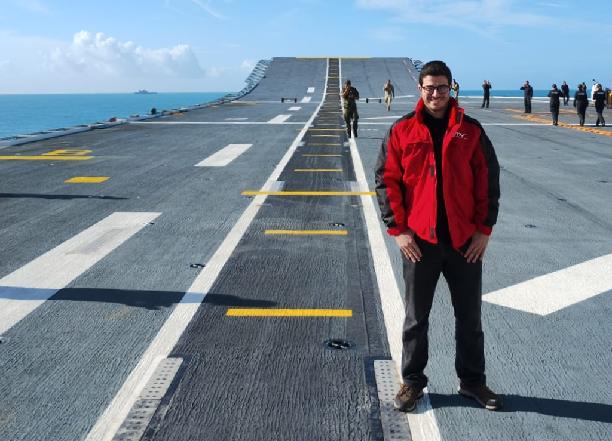

I'm a Spanish builder who loves shipping little projects that make other people's lives easier. Co-founded [**100 Vibe Coding**](~/projects/100-vibe-coding.md) and [**NutrAI**](~/projects/nutrai.md). From ideation to paying customers, I like connecting with purpose-aligned people and getting things out the door.

# Background

Tinkerer since I was 6. Always wanted to be an inventor; computer science let me create without a budget. Based in Madrid (from Menorca, 2000). I like understanding how things work, simplifying real problems, and learning a bit more every day.

Studied Computer Science at the Autonomous University of Madrid, with a year abroad at Utrecht University.

# What I've shipped

- **Product Hunt #3**: Product of the Day with [100 Vibe Coding](~/projects/100-vibe-coding.md) (~2k MAU)
- **B2B traction**: cold-called until **40+ professionals** were using [NutrAI](~/projects/nutrai.md)
- **15+ side projects**: some live in this portfolio; others include [Kloom Studios](~/projects/kloom-studios.md) (7+ countries, 100K+ players), [OneReferral](~/projects/one-referral.md), [One Song a Day](~/projects/one-song-a-day.md), [Clicky Code](~/projects/clicky-code.md), [Cifras del Mundo](~/projects/cifras-del-mundo.md)

# Day job

Still building in two places:

- **[Founding engineer @ nutsh.io](~/experience/nutsh-io.md)** (Dec 2025–present): Brain-AI Interface: embedded software, 3D, AI infra (SkyPilot), architecture, branding
- **[AI Team Lead @ GMV](~/experience/gmv.md)** (2023–present): R&D on AI for European defense

# Outside the IDE

I like building in general, from sewing bags to R/C submarines. Team sports (football, padel), scuba, ex-violinist. Practiced cardistry for three years and built a small community around it in Madrid.
