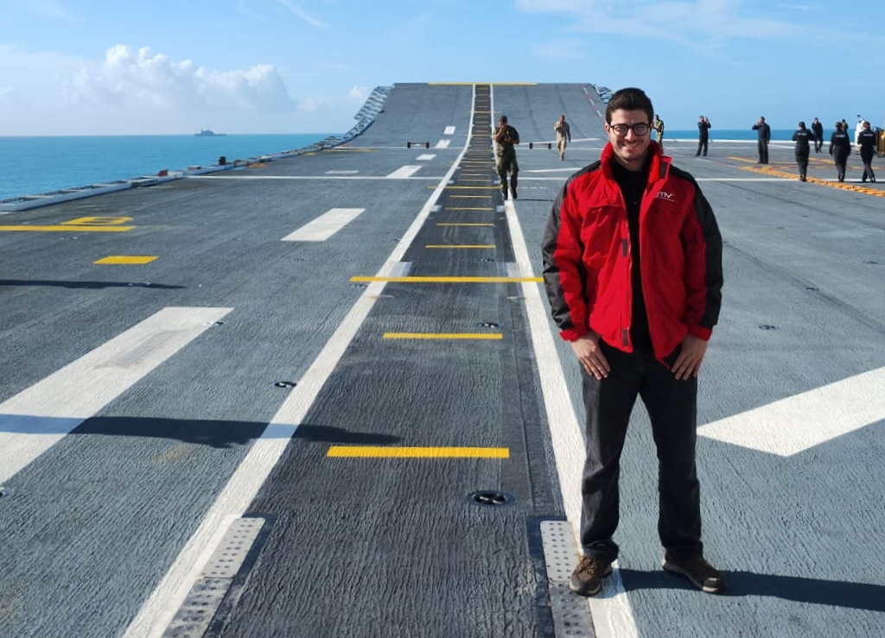

+++
title = 'About'
date = 2023-10-24T15:27:29+02:00
draft = false
+++
#

Welcome! I am Rómulo, a passionate and innovative computer scientist and software engineer based in Madrid, Spain. My journey in the realm of technology began at the Autonomous University of Madrid, where I delved deep into the intricate world of computer science. I always wondered how things worked, tried creating and developing new projects to make everybody's day to day life easier.

I am currently working in GMV as a fullstack software developer for european defense projects.

The technologies that I use the most in a day to day basis are Java Swing, Liferay, Python, PyTorch, OpenCV and Docker.

Thank you for visiting my portfolio. I look forward to the opportunity to collaborate and create a more efficient, interconnected, and innovative world together.

Best regards,

Rómulo García.

