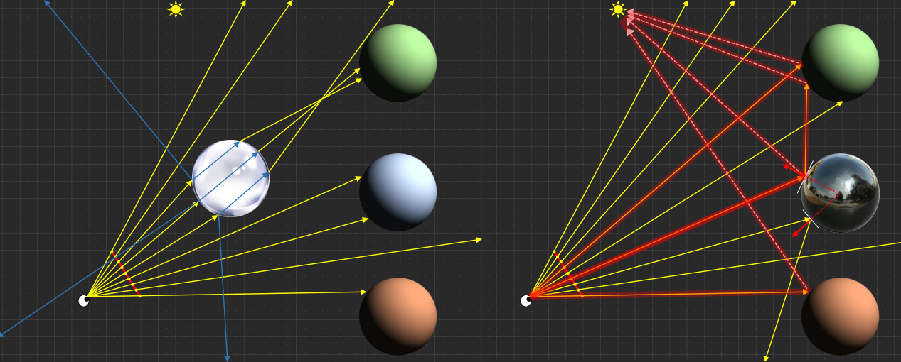

First assignment consisting of a Whitted-style ray tracer. This is a
recursive rendering algorithm for determining light transport between one or
more light sources and a camera, via scene surfaces, by tracing rays backwards
into the scene, starting at the camera.

Second assignment consisting of a basic 3D engine. The 3D engine is a tool
to visualize a scene graph: a hierarchy of meshes, each of which can have a unique
local transform. Each mesh will have a texture and a shader. The input for the
shader includes a set of light sources. The shading model implemented in the
fragment shader determines the response of the materials to these lights. Moreover, some postprocessing techniques such as anti-aliasing are also implemented.


[Github Link](https://github.com/rogarmu8/Graphics)
