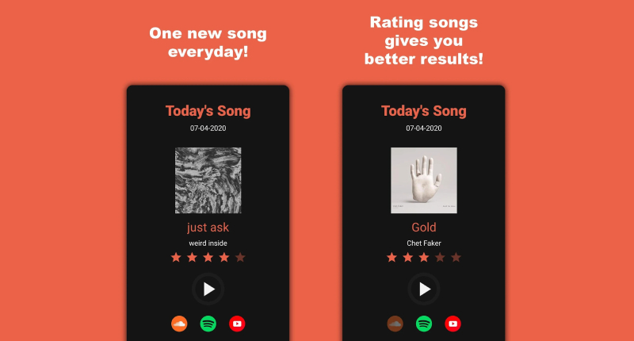

AI Song recommendation system based on user song reviews. Application was made using Android Studio (Java) and Firebase. A Python server-side application was made to manage data and populate the database.


[Google Play Link](https://play.google.com/store/apps/details?id=com.rogarmu8.onesongaday&pcampaignid=web_share)
