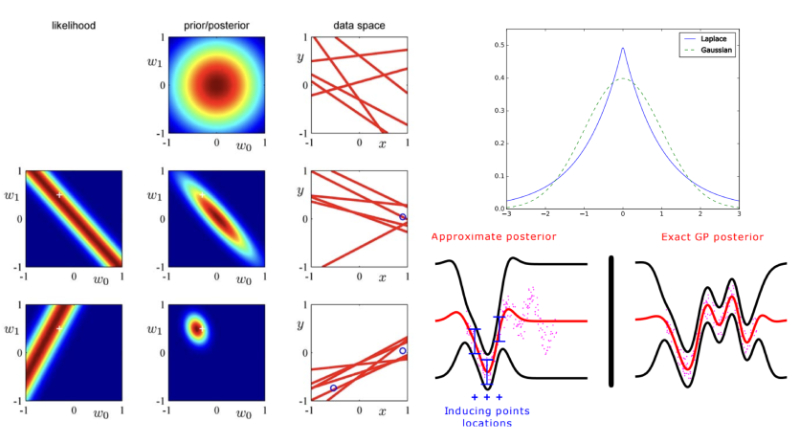

Bachelor Thesis focused on testing Gaussian Processes and Deep Gaussian Processes to predict
wind energy production. Our experiments will take place in Sotavento, a wind mill complex located in the North of Spain. Wind energy is not constant, the wind mills don’t operate at certain speeds, the infrastructures require a lot of space...

Therefore, these predictions are crucial as they can avoid power shortages, provide the basis for making decisions in power system planning and operation, between many other positive applications. We are going to use Gaussian processes as they can scale to very large datasets, and are non parametric. Moreover, the deep Gaussian processes approach increases their flexibility and precision.


[Full Thesis](Using_of_Deep_Gaussian_Processes_for_Wind_Energy_Prediction.pdf)
